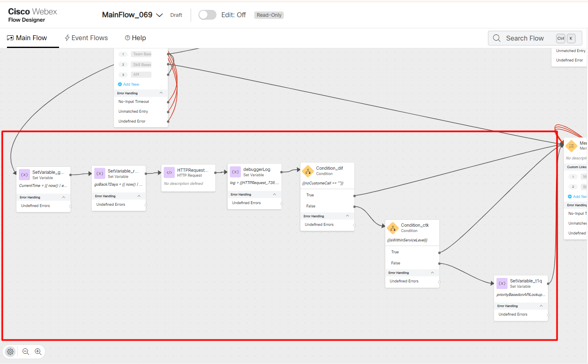
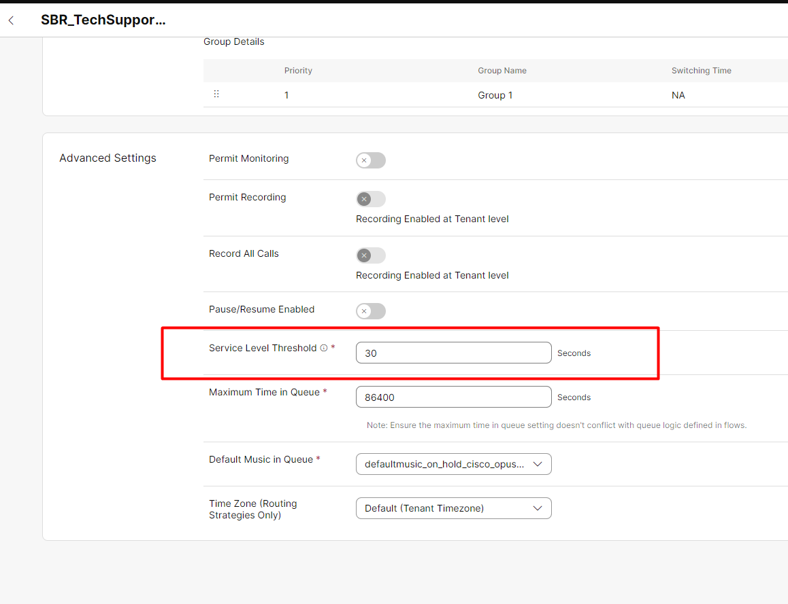
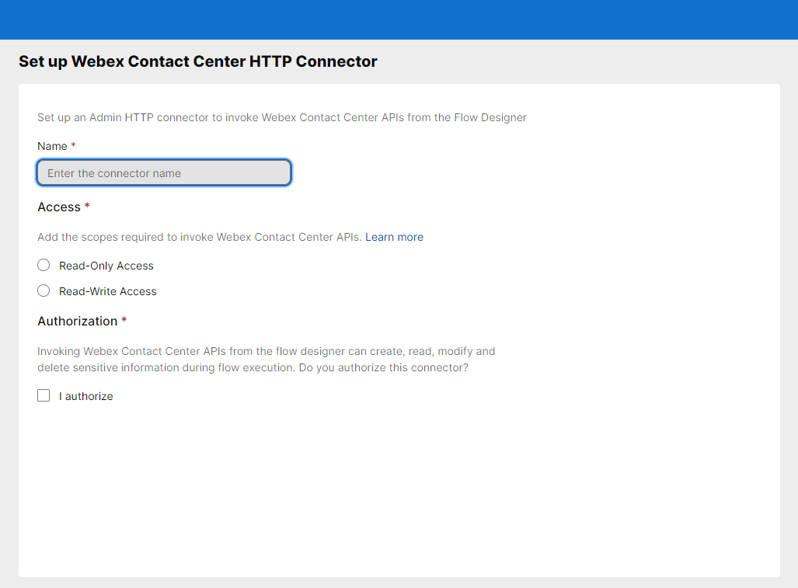

<script>
 function update () {
    const form = document.forms['attendee-form'];
    if (form) {
      form.addEventListener('submit', function (event) {
        event.preventDefault();
        const inputs = Array.from(form.querySelectorAll('input'));
        const values = inputs.reduce((acc, input) => {
          acc[input.id + '_out'] = input.value;
          return acc;
        }, {});

        Object.entries(values).forEach(([id, value]) => {
          const elements = document.getElementsByClassName(id);
          Array.from(elements).forEach(element => {

            console.log(element.innerHTML);
            if(Number(element.innerHTML) > 99 ){
               console.log(`Got a 99+ attendee: ${element.innerHTML}`);
               element.innerHTML = value;
             }
            else{
               console.log(`Got a sub 99 attendee: ${element.innerHTML}`);
               if(element.innerHTML.includes('gmail.com'))
               {
                element.innerHTML = `0${value}`;
                }
               else{
                element.innerHTML = value;
               }
                }
          });
        });
        const attendeeIDInput = form.elements['attendeeID'];
       if (attendeeIDInput && attendeeIDInput.value !== 'Your_Attendee_ID') {
          localStorage.setItem('attendeeID', attendeeIDInput.value);
        }
      });
    }
  };
</script>
<style>
  /* Style for the button */
  button {
    background-color: black; /* Set the background color to black */
    color: white; /* Set the text color to white */
    border: none; /* Remove the border */
    padding: 10px 20px; /* Add some padding for better appearance */
    cursor: pointer; /* Show a pointer cursor on hover */
  }

   /* Style for the input element */
  input[type="text"] {
    border: 2px solid black; /* Set the border thickness to 2px */
    padding: 5px; /* Add some padding for better appearance */

</style>

Please **`submit the form below with your Attendee or pod ID`**. All configuration entries in the lab guide will be renamed to include your pod ID.
 {: .block-warning }

<script>
document.forms["attendee-form"][1].value = localStorage.getItem("attendeeID") || "Your Attendee ID" 
</script>
<form id="attendee-form">
  <label for="attendee">Attendee ID:</label>
  <input type="text" id="attendee" name="attendee" onChange="update()"><br>
<br>
  <button onclick="update()">Save</button>
</form>

<br/>


## Learning Objectives

Callers can be identified based on their relationships with the business they are calling. We've seen examples of identifying the caller by their calling number. What if they've been identified but due to other reasons we are unable to provide them with the default handling? Webex CC now offers the ability to invoke Analyzer APIs from inside the Flow Designer to make routing decisions based on CC metrics.

#### Flow Designer

Navigate to **CUSTOMER EXPERIENCE** and **Flows** and open the MainFlow_<w class = "attendee_out">attendeeID</w>

We will use option 3 under skill based routing 

Review the flow MainFlow_<w class = "attendee_out">attendeeID</w>



Feel free to review each node to understand what is being done. This option will calculate the duration of the last 7 days and use the search API to check if any call from this same ANI was handled outside of the set service level. If yes, then a variable ```priorityBasedonAPIlookup``` is set to 1. 

When setting the caller into a queue (QueueContact node), the same ```priorityBasedonAPIlookup``` variable will be set for the priority of the call. If set to 1, the call will be treated as highest priority and will jump over others waiting in queue ahead of it.

Let's dive in!

#### What is the SLA for these queues?

The queue we use is SBR_TechnicalSupport_<w class = "attendee_out">attendeeID</w>

Navigate to **CUSTOMER EXPERIENCE** - **Queues** and look up this queue. Scroll down to **Advanced Settings**

 

We have defined any call going through this queue needs to be answered under 30 seconds to remain inside service level. 

**First call**

Make a phone call to the EP DN and choose option 2 (yes, **option 2**) but place both Agent and Agent 2 are unavailable to take calls. 

Allow the call to wait for longer than 30 seconds. Now make the agents available and depending on the ANI being recognized or not, one of the agents will receieve the call.


**Second call**

Make another phone call and choose **option 3**. The API call will be triggered from the ```HTTPRequest``` node and set the ```priorityBasedonAPILookup``` variable to 1 since the previous call we made did not get answered inside the service level threshold of 30s.

When the agent is available based on your choice of Mobile Service or Broadband, they will see the call delivered over any other call that was in queue. The agent desktop will show the value of ```priorityBasedonAPILookup``` amongst other fields

**How does this work?**

Under **TENANT SETTINGS** - **Integrations** look at the possible connectors. The **WxCC_API** connector is what is used for this exercise. You do not have to add anything for this lab but if you did the process is now as simple as



The webex CC connector offers access to all possible use cases to invoke from inside the Flow designer. The list of APIs can be found in the [https://developer.webex-cx.com/](https://developer.webex-cx.com/) page. 

#### Summary

You have unlocked yet another source of decision making data points using the APIs from the Flow Designer. The possibilities are endless as more APIs are made available. They will all be accessible through the webex CC connector through the Flows that you build


