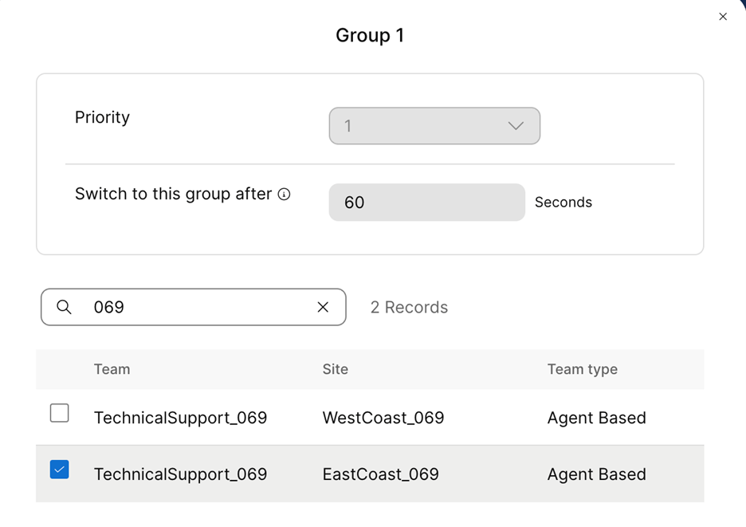

Please **`submit the form below with your Attendee or pod ID`**. All configuration entries in the lab guide will be renamed to include your pod ID.
 {: .block-warning }

<form id="attendee-form">
  <label for="attendee">Attendee ID:</label>
  <input type="text" id="attendee" name="attendee" onChange="update()"> 
 
  <button onclick="update()">Save</button>
</form>

 

## Learning Objectives

**Why CDGs matter**

This setup ensures that when a caller enters the East Coast Technical Queue, they are directed to agents in the East Coast. If you want to get more flexible, you can assign multiple teams to one queue. For instance, if the East Coast queue is often overloaded, another team can be added during configuration to expand the pool of agents.  

But what if the East Coast queue is free, whereas West Coast Queue is filling up. This is where **Rank Queues** comes into play. We can assign a priority to the queues from the perspective of the team. We can let teams choose the order in which they will service the queues they are responsible for. For example, the East Coast Technical Team will always prioritize their own queue first, but if they have no calls waiting, they can assist with the West Coast Queue. 

**Why Rank Queues Matter**

This setup makes sure the team focusses on their specialized tasks first. But in the case of idle time, they can help with other queues, like the West Coast Queue, ensuring maximum efficiency across the teams. 

Now click **Create Group** under **Call Distribution**

!!! Note
    There are two teams of the same name! They are, however, in different sites. The same function can be performed in different geographies or locations

Click **Create Group** again and add the West Coast Team as a backup.

Select **Priority** as `2` and for **Switch to this group after** select `10` seconds

**Rank Queues**

Under **USER MANAGEMENT** click on **Teams** and search for your TechnicalSupport_<w class = "attendee_out">attendeeID</w> team

You will see two teams of the same name but for different sites. Click on one team and setup Rank queues

Click **Select queues**

Select both the queues created above and then click on Select the queue.

For the East Coast team, pick the priority of 1 for the East Coast queue and priority 2 for the West Coast team. 

