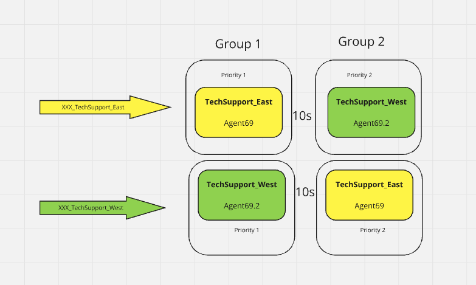

Please **`submit the form below with your Attendee or pod ID`**. All configuration entries in the lab guide will be renamed to include your pod ID.
 {: .block-warning }

<form id="attendee-form">
  <label for="attendee">Attendee ID:</label>
  <input type="text" id="attendee" name="attendee" onChange="update()"> 
 
  <button onclick="update()">Save</button>
</form>

 

## Learning Objectives

We've seen that groups of agents in teams can be associated with queues to help service callers. In this exercise we will adjust how the teams are organized to improve the chances that the caller will speak to an agent **in a team** that we desire. 

**Why CDGs matter**

This setup ensures that when a caller enters the East Coast Technical Queue, they are directed to agents in the East Coast. If you want to get more flexible, you can assign multiple teams to one queue. For instance, if the East Coast queue is often overloaded, another team can be added during configuration to expand the pool of agents.  

Navigate to **Queues** and to the <w class = "attendee_out">attendeeID</w>_TechnicalSupport_East and to  **Create Group** under **Call Distribution**

Expand the **Group**

Edit the west coast team out from Group 1 (we are in the East Coast queue). Now add a second group

Click **Create Group** again and 

Select **Priority** as `2` and for **Switch to this group after** select `10` seconds

Now the assignment will look like this

Repeat the same for <w class = "attendee_out">attendeeID</w>_TechnicalSupport_West queue 

Now we have 

Calls will be offered to the team in Group 1 for 10s **before** they are presented to agents in group 2

Make some phone calls, place the required agents in a not-available state and test this. For example, place call while an agent in group 1 is not available but an agent in group 2 is. The call will not be presented to the agent in group 2 until the 10 second timer has expired. In this fashion you can add many other agent teams to service the caller after a set time interval. 

!!! Note 1
    Every call distribution team expansion that happens is occurring for **a single call**. This way the treatment for every call can be programmed to make agents available based on your business needs. This is a common strategy to bring more agents to the caller. Some contact centers allow agent skills to be reprogrammed (re-skill) to handle calls they would not usually but that re-skill will be permanent until changed again. 

!!! Note 2
    Every team that you bring to the caller in queue **must** be associated with the queue during provisioning

What if we do not like this wait? Agents in the team in the second group may be available at the same time when the call was offered to group 1. Why keep the caller waiting for 10s while agents are already available in group 2?

But, isn't that what we did in the previous lab? We had both teams offered the call **simultaneously** 

While we do that we also want to **prioritize** the West team to answer calls from the west queue **first** before we answer calls in the east queue. Remember, both teams are servicing both queues. So far, it has not been possible to do this without introducing a wait time between the groups. And even if we do, the west team could receive a call from the east queue that was waiting for longer even though a call is waiting in the west queue.

## Summary

We see that the expansion of call distribution groups is an elegant way to offer more agents to handle the caller, call-by-call. This eliminates the need to re-skill agents reactively. But, the administrator would like to let each team handle callers from their region **first** before they handle calls for others
