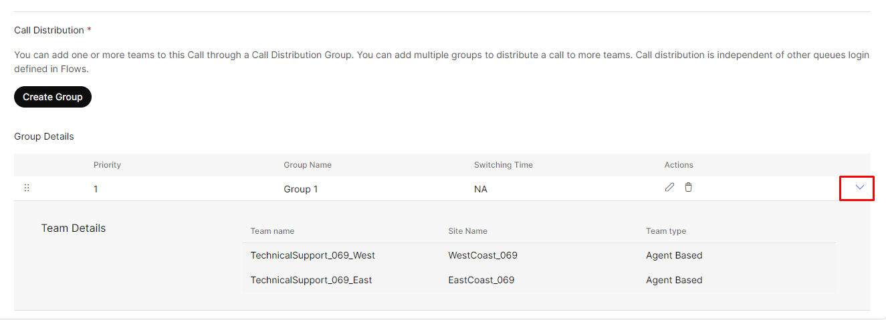

Please **`submit the form below with your Attendee or pod ID`**. All configuration entries in the lab guide will be renamed to include your pod ID.
 {: .block-warning }

<form id="attendee-form">
  <label for="attendee">Attendee ID:</label>
  <input type="text" id="attendee" name="attendee" onChange="update()"> 
 
  <button onclick="update()">Save</button>
</form>

 

## Learning Objectives

 In the previous section you saw that it was possible for one team to help another but we either needed to make them available simultaneously or introduce a gap of a few seconds before the second team offers to help. This means
 
 1. Some teams may be answering calls from other queues at the expense of their own queue 
 2. Agents may be free in another team but won't be matched with the caller until the time interval between groups expires
 
 With rank queues, we can assign a priority to the queues from the perspective of the team that answers calls from them. We can let teams choose the order in which they will service the queues they are responsible for. For example, the East Coast Technical Team will always prioritize their own queue first, but if they have no calls waiting, they can assist with the West Coast Queue. 

**Why Rank Queues Matter**

This setup makes sure the team focusses on their specialized tasks first. But in the case of idle time, they can help with other queues, like the West Coast Queue, ensuring maximum efficiency across the teams. 

#### Configuring Rank queues

Let us go back to how we setup the teams in the call distribution groups under the queues for east and west

Do this by editing the **Group** for both queues - <w class = "attendee_out">attendeeID</w>_TechSupport_East and <w class = "attendee_out">attendeeID</w>_TechSupport_West

Now that you have adjusted the teams to both be available to the queue at the same time, we need to provide the order in which the queues will be serviced by each team

Navigate to **USER MANAGEMENT** - **Teams** and look for your team. Scroll down to the **Queue Ranking** section and configure the **East** team as below

Now repeat the same for the West team but reverse the rank

This configuration allows the teams to operate like below

!!! Note
    Both teams see the **same** two queues and the contacts in them. 

This is a harder test to simulate with one phone call. Please request help from your lab proctor if you would like to try this.

1. Place both agents into "Meeting"
2. Place the first call to the East queue
3. Place another call to the West queue

Without queue rank, when either agent becomes available the longest waiting call (in the East queue in this example) should be delivered to them. Now, with queue ranking

1. Make Agent 2 (in the West team) available
2. They will receive the call in the West queue that was placed later, first since their queue rank decides that
3. Once Agent 2 finishes the call and goes back to available, they will receive the call from the East queue, that was placed earlier

The calls to the East queue will be handled first by the East team. The same applies to the West team. If all calls in the East queue were drained and the West queue looked like below

Then the two remaining contacts will be handled by **both** the East and West teams since the East team has no contacts left in the East queue

#### Summary

We have organized agents by teams and seen different ways to prioritize callers to some agents and how teams can choose their own priority to handle their primary task and also 'help' without affecting their primary objectives. We will now move to elevate customer experience by personalization of contacts and finding the best possible way to service them. 

1.	Teams Aligned with Tasks: Agents are grouped into teams based on the tasks they specialize in, like technical support or order status. 
2.	Flexible Backup with Queue Ranking: Teams can act as backups for other teams, ensuring calls are handled efficiently when primary teams are busy.
3.	Simplified Management with Call Distribution Group: Multiple teams can be added to a single queue, making call distribution smooth and flexible. 

