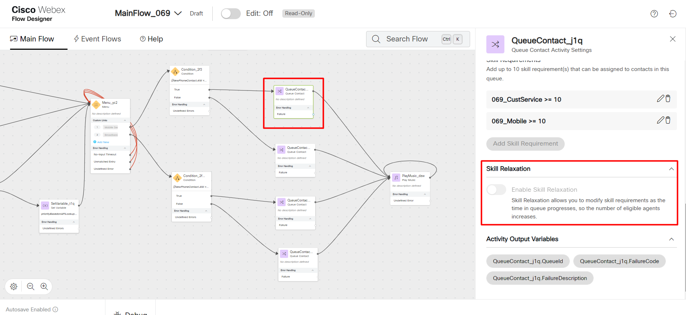
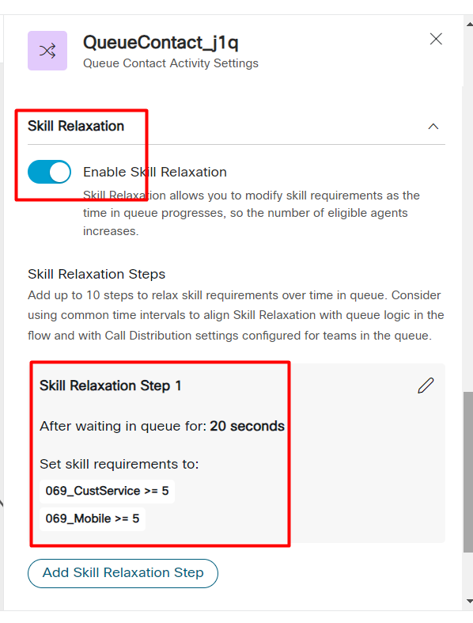

Please **`submit the form below with your Attendee or pod ID`**. All configuration entries in the lab guide will be renamed to include your pod ID.
 {: .block-warning }

<form id="attendee-form">
  <label for="attendee">Attendee ID:</label>
  <input type="text" id="attendee" name="attendee" onChange="update()"> 
 
  <button onclick="update()">Save</button>
</form>

 

## Learning Objectives

When callers are waiting in queue and your best agents for those calls are busy, you can use the strategy of skill relaxation to let your callers be answered by the next best agents. In some CC systems, supervisors may re-skill agents to move them to where callers are. In this lab exercise you will build upon what you already built in the previous section

#### Update the flow 

Navigate to **CUSTOMER EXPERIENCE** and **Flows** and open the MainFlow_<w class = "attendee_out">attendeeID</w>

In the previous example note which leg of the SBR flow the call went to. Edit the **QueueContact** node and check the **Skill Relaxation** section.

Set your Flow into **Edit** mode, if applicable

Enable **Skill Relaxation** and set it like below

We have now set the flow to wait for 20s after which the caller requirement will be lowered from a level of 10 to a level of 5.

#### Make a test call

Let's choose the premium caller flow. 

Place Agent 1 in "Meeting" and Agent 2 in the Available state. 

Place a call that would normally go to Agent 1. Since Agent 1 isn't available the caller will wait in queue for 20s after which the skill will be relaxed to meet the requirements of Agent 2.

#### Summary

Instead of re-skilling an agent, each caller can be subject to a skill relaxation strategy that can cater to their unique needs **without altering the skills of agents**. Instead, sill relaxation acts on a call-by-call basis.

Let's see some advanced use cases of how to route calls based on current and previous contact center performance

