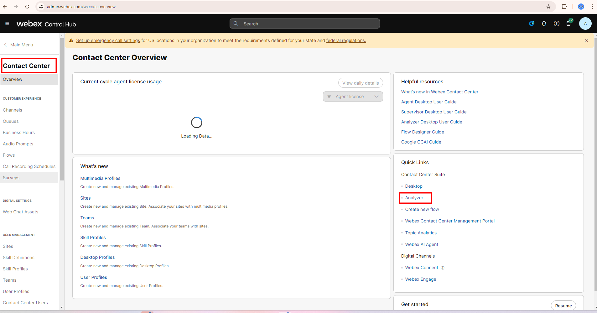
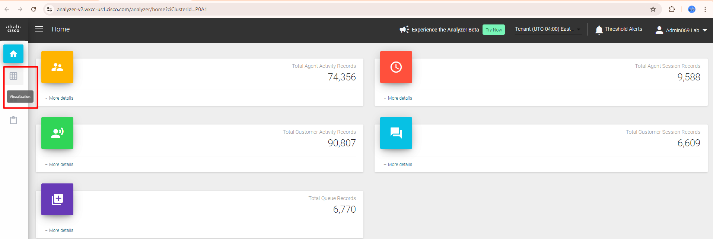
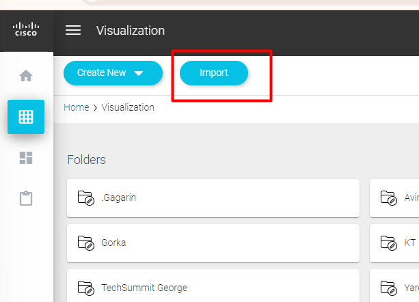
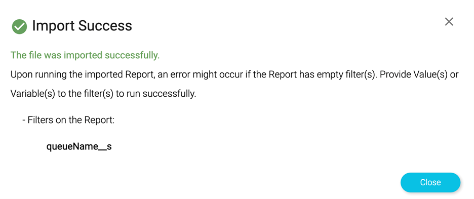
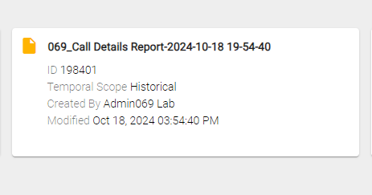
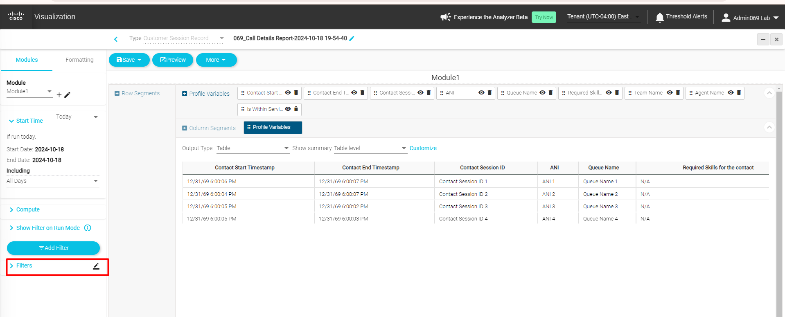
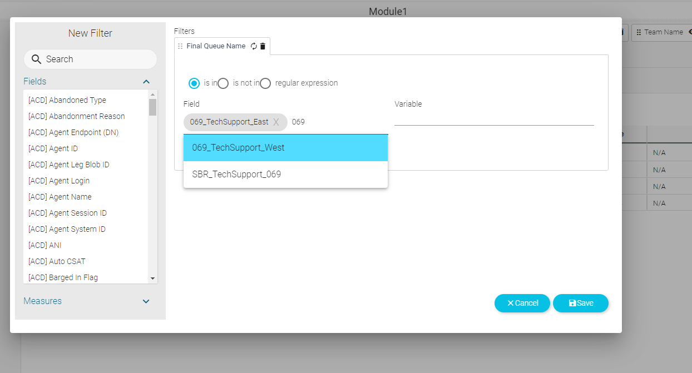
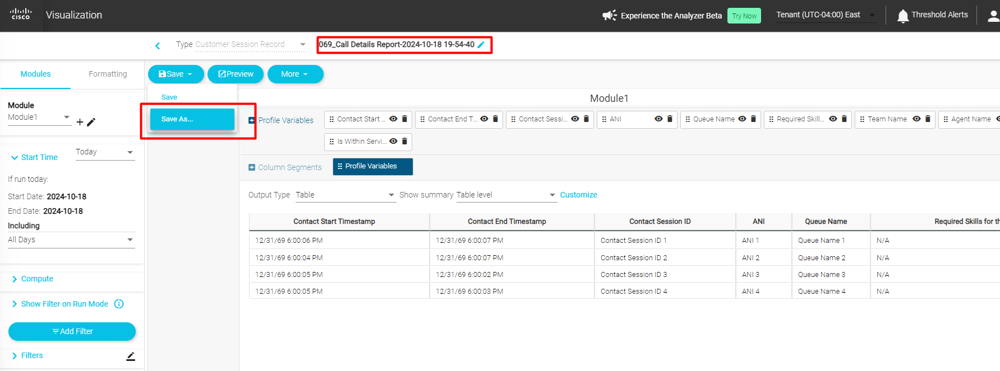
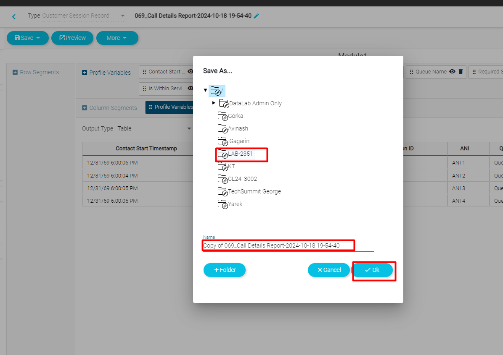

# Analyzer report

#### Creating your Analyzer report

Login into your control hub admininstrator interface at [https://admin.webex.com](https://admin.webex.com)

Click the **Contact Center** link on the left pane and click on the **Analyzer** link

Alternatively you can also visit the link directly at [https://analyzer-v2.wxcc-us1.cisco.com/analyzer?ciClusterId=PF84 ](https://analyzer-v2.wxcc-us1.cisco.com/analyzer?ciClusterId=PF84)

Click on **Visualization** 

[Save as](../assets/reporting/Call_Details_Report.json) the report template to your computer and **Import** 

!!! Note
    The name of the report is contained inside the JSON file. If you wish, you can edit and save the file in notepad++ and change the name to reflect your attendee ID

Now search for **Call_Details_Report**. You will see

the report appended with a time stamp.

Let's edit the report, click on the three vertical dots on the report tile and choose **Edit**.

Now use the filter to add the queues you are interested in 

Click **Save** 

Now remember to change the name of the report to reflect your **attendee ID** and 

Click **Preview** to run the report