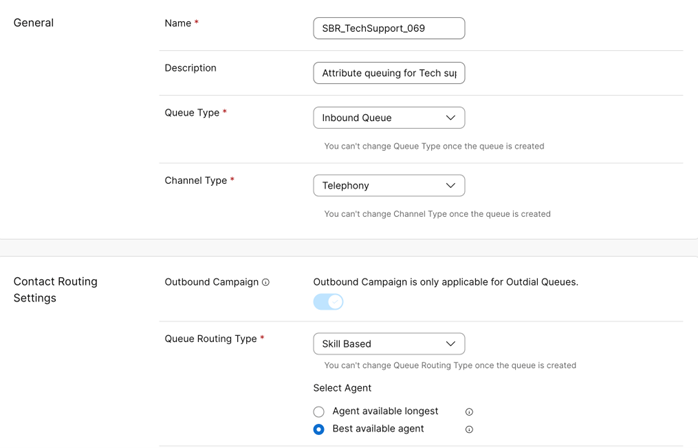
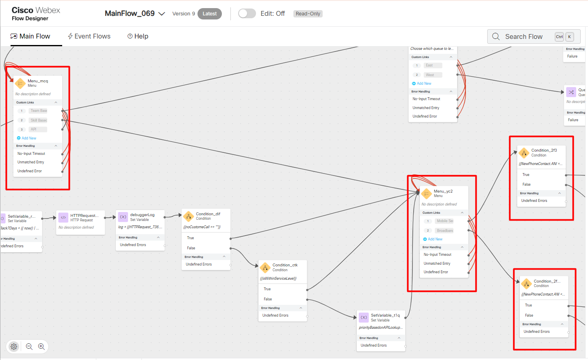

Please **`submit the form below with your Attendee or pod ID`**. All configuration entries in the lab guide will be renamed to include your pod ID.
 {: .block-warning }

<form id="attendee-form">
  <label for="attendee">Attendee ID:</label>
  <input type="text" id="attendee" name="attendee" onChange="update()"> 
 
  <button onclick="update()">Save</button>
</form>

 

## Learning Objectives

Learn about attribute based routing (sometimes referred to as skills-based routing) and how it helps match the caller and the agent

**The common caller experience**

Imagine that you are a above average spending customer with a business. You've used their products and services for a number of years, but now need some assistance. It is Natural to think *"With the relationship I have with the business, I deserve nothing but the best. I want someone that can understand what I need and resolve any problem I have"*

You call the contact center hoping to be prioritized and provided special treatment but think *"I hope I get to speak to someone that doesn't keep me on the phone for too long trying to understand what they can do to help me".

**The experience of the customer service representative (agent)**

The agent receives your call and quickly realize that your question is beyond the area of their expertise. They think "Uh oh, I've asked many clarifying questions already and I am not the best fit for this issue. I may have to ask them more questions or send this call to someone else."

Both the customer and the agent are left wanting a better experience. They both feel like they both deserve better.

**Skills-based routing**

With SBR, the solution can be configured to know who the caller is, what their relationship is worth and match them with the agent that has the right expertise (skills) to handle them. For the customer this is a very pleasant situation that started off by needing to call in, no one likes that. For the agent, the ability to solve a problem feels empowering.

**Some immediate benefits of SBR**

There is no need to create multiple queues for every possible combination of customer query. For example: English product 1 regular, Spanish product 1 regular, English product 1 premium, Spanish product 1 premium, Spanish product 1, English service 1, Spanish service 1 etc. You get the idea.

Instead, we could have one smart system that matches each call to the right agent based on the skills requested. Its simpler, faster, and it frees the administrator from managing an overwhelming number of queues. **One queue, many possibilities**

#### Create Skills Based Queue

Navigate to **CUSTOMER EXPERIENCE** - **Queues** and click **Create Queue**

Create a new queue SBR_TechSupport_<w class = "attendee_out">attendeeID</w>

Under **Call Distribution** create the groups of teams like before

Keep the rest of the settings like below and click **Create**

#### Create skill definitions

We will now create skill definitions, which are attributes which the caller requires, and the agent should possess to service the interaction. 

Webex Contact Center offers four types of skill definition.

1.	**Text:** A free-form text skill that must be matched exactly. For example, you might define a skill named Extension that will let you route a call to a specific agent’s extension number based on digits entered by the caller in response to a prompt. The text value can include up to 40 characters, including spaces.
2.	**Proficiency:** Can have a value ranging from 0 to 10 that represents the agent’s level of expertise in the skill. For example, you might define a skill for each language that your agents speak.
3.	**Boolean:** Can have the value of True or False to indicate whether the agent has the skill. For example, you might define a skill named Premier Service to ensure that your most valuable customers get the best service. Your most experienced agents can be assigned a value of True, and your least experienced agents can be assigned a value of False.
4.	**Enum:** A named set of predefined values. For example, a skill named Line of Business might have a set of three values: Sales, Service, and Billing. Each value can include up to 20 characters, including spaces.

For this exercise, we will create 3 skill definitions:

1.	**CustService:** To indicate the level of service which the caller requires. 
2.	**Mobile:** This will indicate the product proficiency.
3.	**Broadband:** This will indicate the product proficiency. 

Create athe skill definitions under the **USER MANAGEMENT** - **Skill Definitions**

#### Create Skill Profiles

A skill profile is like a set of qualifications an agent needs for specific tasks. For example, for premium customers, you want senior agents who can access customer contracts and have top-notch customer service skills. These agents are chosen because they can provide the best experience for premium callers. You assign this set of skills to ensure the right agents handle the right customers.

For this exercise, we will create three skill profiles:

1.	**Premium Care (L3) Profile:** For the most senior agents (L3), who handle premium customers and can handle multiple product lines. [CustService = 10, Mobile =10, Broadband =10]
2.	**Advanced Support (L2) Profile:** For mid-level agents (L2), who address more advanced but not top-tier queries [CustService = 5, Mobile =5, Broadband =5]
3.	**Basic Assist (L1) Profile:** Basic Assist (L1) Profile – For entry-level agents (L1), handling routine or simple customer inquiries. [CustService = 1, Mobile =1, Broadband =1]

#### Assign skill profiles to agents

Under **USER MANAGEMENT** - **Contact center Users** locate Agent<w class = "attendee_out">attendeeID</w>. Under **Agent Settings** assign the <w class = "attendee_out">attendeeID</w>_PremiumCareL3Profile 

Similarly, assign <w class = "attendee_out">attendeeID</w>_AdvancedSupportL2Profile to Agent<w class = "attendee_out">attendeeID</w>.2 and <w class = "attendee_out">attendeeID</w>_BasicAssistL1Profile to Agent<w class = "attendee_out">attendeeID</w>.3

| Agent | Skill Profile |
|-------|---------------|
|Agent<w class = "attendee_out">attendeeID</w>|<w class = "attendee_out">attendeeID</w>_PremiumCareL3Profile|
|Agent<w class = "attendee_out">attendeeID</w>.2  |<w class = "attendee_out">attendeeID</w>_AdvancedSupportL2Profile|
|Agent<w class = "attendee_out">attendeeID</w>.3 | <w class = "attendee_out">attendeeID</w>_BasicAssistL1Profile|

#### Configuring the Voice flow

Under **CUSTOMER EXPERIENCE** - **Flows** Look for MainFlow_<w class = "attendee_out">attendeeID</w>

Login Agent 1 and Agent 2 into the agent desktop. The example below is for attendee ID 069 (Agent 3 is optional)

Like we did in the teams-based routing lab we need to update the flow to queue to the configuration you have built. See the nodes to update in the image below

**Let's make some test calls**

Make a call to the EP DN for your lab and pick **option 2** for Skills based routing.

Option 2 will take you to another menu option to choose if you would like support for Mobile Service or Broadband.

The **Condition** node that follows will check your ANI and if matched will provide a premium routing  to the caller. For the sake of this exercise, you can edit the Flow and replace the number in the two **Condition** nodes with the number you are calling from

If a match is found, then you, the caller will be sent to Agent 1, who takes care of premium customers. If you were to change the number in the condition node and repeat the test, you will notice that the caller is redirected to Agent 2 who has a L2 profile.

!!! Note 
    We were able to offer differentiated service even though the contacts were all placed in **the same queue**. This is because the categorization is done at a call level by identifying the service it needs through the attributes that are associated with the call. There is no need to create multiple queues for every combination of caller requirement like we did with the Teams based routing example (TechSupport East and TechSupport West queues)

This simple scenario illustrates some key concepts

1.	**Right Agent for every Call:** Skills-Based Routing (SBR) ensures every caller is connected to an agent who knows exactly how to help. 
2.	**No More Complex Queues:** SBR eliminates the need for creating multiple queues for different customer and product combinations. 
3.	**Faster Resolution, Happier Customers:** By matching calls based on expertise, SBR boosts customer satisfaction and improves agent efficiency. 

What other strategies can we use when using skills based routing? Onward to **Skill Relaxation**

