

Please **`submit the form below with your Attendee or pod ID`**. All configuration entries in the lab guide will be renamed to include your pod ID.
 {: .block-warning }

<form id="attendee-form">
  <label for="attendee">Attendee ID:</label>
  <input type="text" id="attendee" name="attendee" onChange="update()"> 
 
  <button onclick="update()">Save</button>
</form>

 

!!! Note
    The input in the images that follow are only examples. They do not reflect the input you need to use in the lab exercises. In some cases, the input in the images may not follow the same attendee or pod ID from previous images. They are for representation only

## Enhancing the caller experience: The foundation of call routing techniques

Imagine you are calling your telecom provider about a technical issue. You hope to get connected with the right agent quickly. But depending on the nature of your inquiry, the system can either route you directly to a specialized technical team or to an order status team if your issue is related to a product delivery. 

### Teams based routing / Longest available routing

In this setup, specific teams are aligned to handle certain types of calls – like a technical team for troubleshooting or an order status team for inquiries about shipments. Teams-Based Routing allows us to organize agents into these groups called Teams and ensure the caller receives the right expertise. 

### Multimedia profile

**What is it?**

A Multimedia Profile defines the various channels through which an agent can communicate with customers. Think of it as a toolbox filled with different tools (or channels) that agents can use to assist customers. Each tool is designed for specific tasks, making the agent more versatile and effective.

**How does it work?**

- Channel Assignment: Each agent can be assigned to specific channels based on their roles and preferences. For instance, one agent might handle phone calls and chats, while another might focus on emails and social media interactions.
- Team-Based Approach: Teams can have a collective Multimedia Profile, allowing for a broader range of customer interactions. For example, a technical support team might manage both chat and phone calls, ensuring coverage across all channels.

**Configuration**

Login into Control Hub [https://admin.webex.com](https://admin.webex.com)

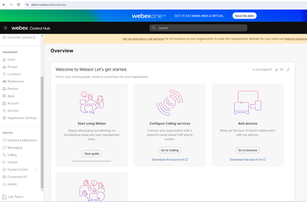

Look for the contact center option in the left pane under **SERVICES – Contact Center**

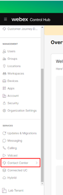

Navigate to **DESKTOP EXPERIENCE - Multimedia Profiles** and click **Create Multimedia Profile** on the top right corner of the page

Create a new MMP profile with a name MMP_<w class = "attendee_out">attendeeID</w> where <w class = "attendee_out">attendeeID</w> is your 3-digit attendee ID

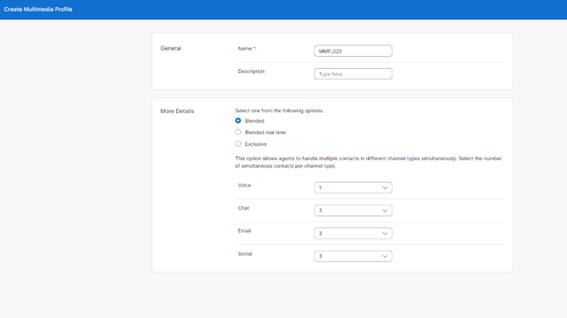

Set the **Blended** in the More Details section and set the Voice to 1, Chat, Email and Social all to 3

Click **Create**

You have now configured a multimedia profile for the agent to handle 1 voice and 3 each of other digital channels simultaneously.

### Site

**What is it?**

Consider a company operating in various regions, each with a unique geographical location where agents are based. These locations can range from bustling urban centers to quieter suburban areas, affecting how services are delivered and how agents interact with customers. The resources, technologies, and local knowledge available at each location play a crucial role in enhancing customer service.

**Configuration**

Under **USER MANAGEMENT** on the left pane navigate to **Sites**

Click **Create Site** on the top right corner to create a new site East_<w class = "attendee_out">attendeeID</w> and choose the **Multimedia Profile** you created in the previous step MMP_<w class = "attendee_out">attendeeID</w>

Click **Create**

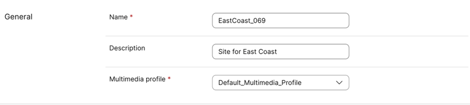

Repeat the above steps to create a West_<w class = "attendee_out">attendeeID</w>

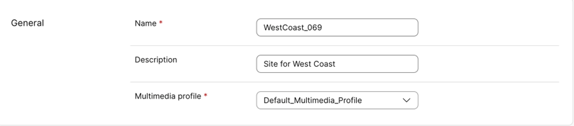

### Teams and agents

**What is a team?**

Agents who specialize in similar tasks are grouped together into **Teams**. For example, all the agents who handle technical issues form a Technical Team, and those who deal with order inquires make up the Order Status Team. This way, when a caller needs help, the system directs the call to the right team of experts. 

By organizing agents into teams, we ensure that callers are handled efficiently by agents with the right knowledge. So, if you need help fixing your phone, you’ll be connected to a technical expert instead of someone who only knows about orders. 

As part of this setup, when agents log in to the system, they choose the team to login which is assigned to the agent. For instance, if the agent is part of the East Technical Team, they login under that team’s profile. This way, the system knows which team they belong to and routes calls to them accordingly. 

**Configuration**

Under **USER MANAGEMENT** in the left pane navigate to **Teams** and click **Create Team.**
Create the TechnicalSupport_<w class = "attendee_out">attendeeID</w> team where <w class = "attendee_out">attendeeID</w> is your pod ID. Choose the EastCoast_<w class = "attendee_out">attendeeID</w> site and  and **Create** the team.

On the next screen, click **Done**

Now create another TechnicalSupport_<w class = "attendee_out">attendeeID</w> team and assign it to the WestCoast site

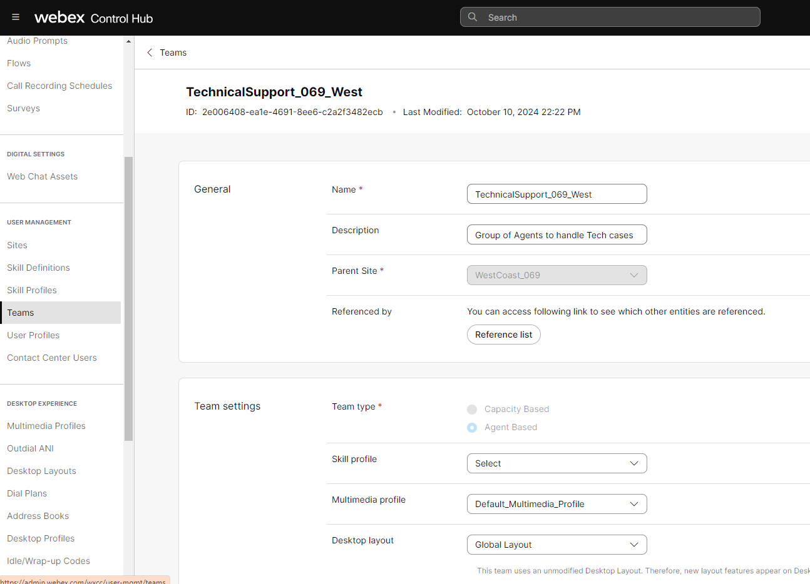

### Setup Auxiliary codes

Idle or wrap up codes are two types of Auxiliary codes. 
- **Idle codes** typically indicate why an agent is not available to handle customer contacts such as during a lunch break or meeting. 
- **Wrap-up codes** indicate the result of the customer interaction, for example, the agent escalated the contact, or sold a service.

Navingate to **DESKTOP EXPERIENCE - Idle/Wrap-up Codes** and click on **Create Idle/Wrap-up Code**

Create one or **TechncialSupport**

Click **Create**

Once these wrap-up codes are created we need to make them available to agents. This is done through `Desktop Profiles` that the agents get assigned

Under **DESKTOP EXPERIENCE - Desktop Profiles** select the **Agent-Profile (Auto WrapUp)** and click on the **Idle/Wrap-up Codes**

Ensure that the **Wrap-up Codes** is selected as **Specific** and select the new wrap-up codes that we created in the previous step. You may need to make one of the wrap-up codes as default

The system will also choose **All** Idle codes available for the agent to indicate their unavailability for handling customer contacts

### Setup Agents

Under **USER MANAGEMENT** in the left pane navigate to **Contact Center Users**.
Search for attendeeID in the search box of the Contact Center Users page. attendeeID is your pod ID.
Click on the agent created for your pod and configure them for Contact Center.

Search for <w class = "attendee_out">attendeeID</w> in the search box of the Contact Center Users page. <w class = "attendee_out">attendeeID</w> is your pod ID.

Now click **Save**

Configure the same for the second Agent:

### Verify access to the agent desktop

> Please use Google Chrome as the web browser when using webRTC as the voice endpoint

!!! Note
    Since we will be using the same Chrome browser for different roles we will use the **Chrome Browser user profiles** to allow multiple logins into the different components of the Webex contact center. For the control hub, use the Administrator profile created for you in the Chrome browser. Always offer Chrome to **remember your credentials and password** for this lab

Use a different Chrome browser profile for each agent

Navigate to **<https://desktop.wxcc-us1.cisco.com>** and login using the agent configured to the Technical_support team

Remember to login using the below configurations

Accept the emergency calling notification. Allow access to the audio devices the first time you login.

Once logged in click on the Agent initials on the top right to verify your successful login

Test the login for the other agents using their respective web browser profiles of Google Chrome

In this section you have accessed the Control Hub, configured agents needed for the rest of this lab exercise and logged them in with some help from the Chrome browser profiles.

### Queues

A Queue is like a virtual ordered line that callers are placed in while waiting for an agent to become available. Think of it like standing in line to enter a movie hall. The system organizes all incoming calls into different queues based on the type of request. For example, callers from east coast requiring technical support go into the TechnicalSupport_East, while those from West Coast are placed in the TechnicalSupport_West Queue. 

Once we’ve defined queues for different call types, we need to assign teams to handle those queues. This is done using Call Distribution Group (CDG). The Call Distribution Group allows us to assign one or more teams to a single queue. For example, both the technical teams could be associated to their respective queues. 

**Create Queues**

Login into Control Hub https://admin.webex.com with your administrator credentials to begin our configuration.
Navigate to **Contact Center - CUSTOMER EXPERIENCE - Queues** and click **Create Queue.**

Create the <w class = "attendee_out">attendeeID</w>Q_TechSupport with the below settings (it is easier to search for queues when the attendee ID is prefixed to the queue name instead of after it)

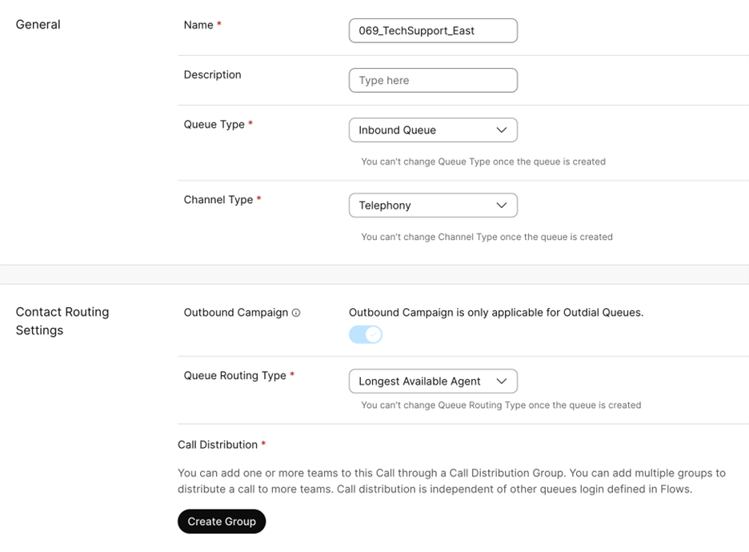

!!! Call_Distribution
    This is a collection of one or more groups that will each contain one or more teams of agents who will answer calls from this queue.

Since our queue is for TechnicalSupport_East, we would like our team from the East coast to answer the calls first. 

Configure the **Group** like below

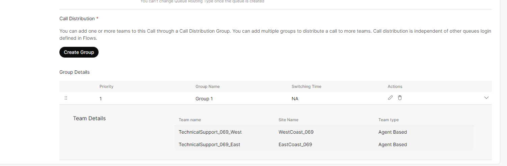

Click **Save**

Under **Advanced Settings**, configure the parameters as below and click **Create**

Repeat the same steps to configure the Technical Support Queue for the West Coast. 

We now have two queues - TechSupport_East and TechSupport_West. Both have the east and west coast technical support teams configured under group 1

**Login agents**

Before we login agents we will make the right agents are members of the required teams

Navigate to **USER MANAGEMENT** - **Contact Center Users**

Search for Agent<w class = "attendee_out">attendeeID</w> 

This shows the agents and the teams they belong in. 

Verify that your agents are still logged in

**Flow Designer**

For this lab we have created a flow that you will all import and use for the rest of the lab. 

 the flow and 

[Download](../assets/MainFlow_template.json){download=""} the flow to your computer and import the flow

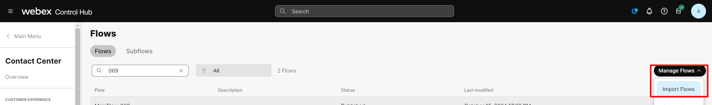

Open the Flow MainFlow_<w class = "attendee_out">attendeeID</w> from **CUSTOMER EXPERIENCE** - **Flows**

!!! Note
    This lab uses only one flow and has multiple menu options to try the scenarios. There may be aspects of this flow that you don't yet understand. They will become clear as you go through the rest of this lab

Remember this Flow is only a template, you need to replace some aspects of the flow with the configuration objects you created. See the image below for what needs to be changed

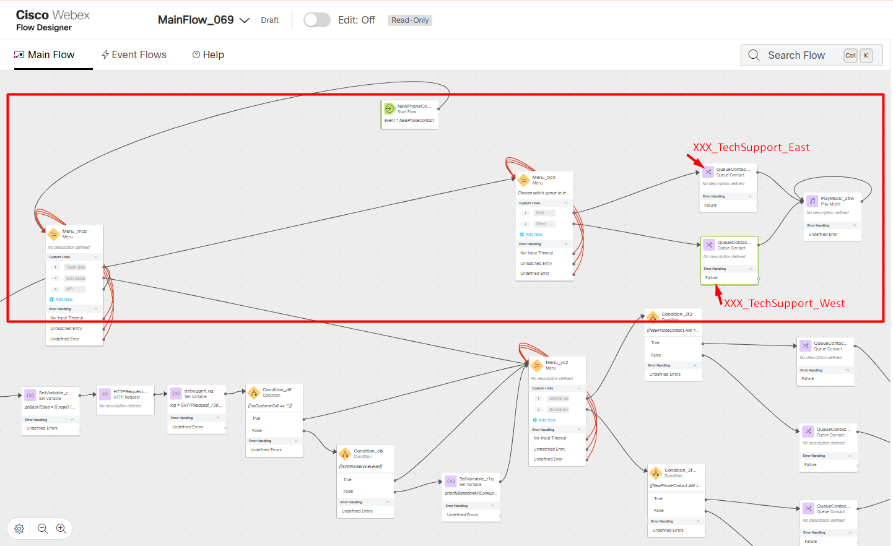

In order to invoke this flow one needs to assign this flow to an entry point. Navigate to **CUSTOMER EXPERIENCE** - **Channels** and  click **Create Channel**

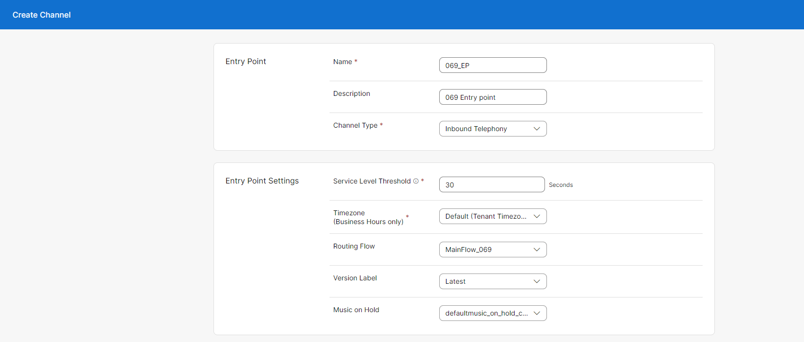

Use the Flow you will be using in the **Routing Flow** field. Look up the Entry point Dial Number (EP DN) in the email you received (subject: WebexCC: Lab Access)

setup the EP DN as the **Support Number** 

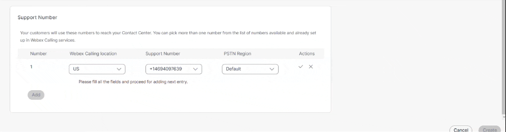

Click **Create**

**Time to make some phone calls**

From any device at your disposal to make calls, call the EP DN to invoke the Flow. Choose the **option 1** for Teams based routing. 

!!! Note
    For the sake of simplicity the choice of the queue is left to you as an input. This is usually done by identifying the caller through an ANI check against a CRM or through other means.

Irrespective of which queue you are park the caller into the caller will be answered by an agent in the East or West team. You can test this by placing one of the agents into the "meeting" state from "available" and try calling.

Then try again by placing the other one in "meeting"

### Summary

Both teams are made available for the callers simultaneously. We did not prioritize one team over the other. For that let's try the Call Distribution Group

