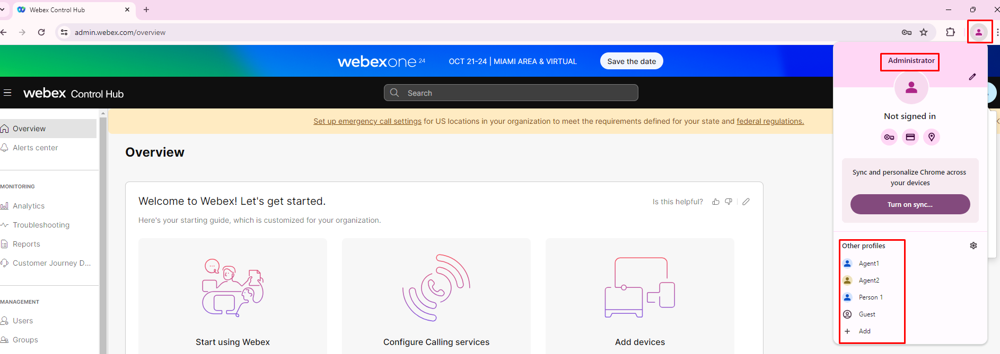
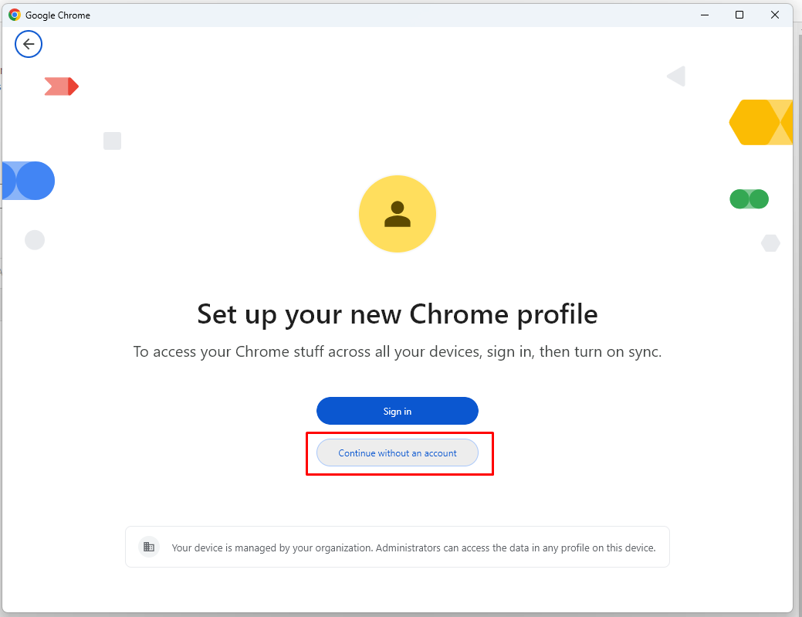
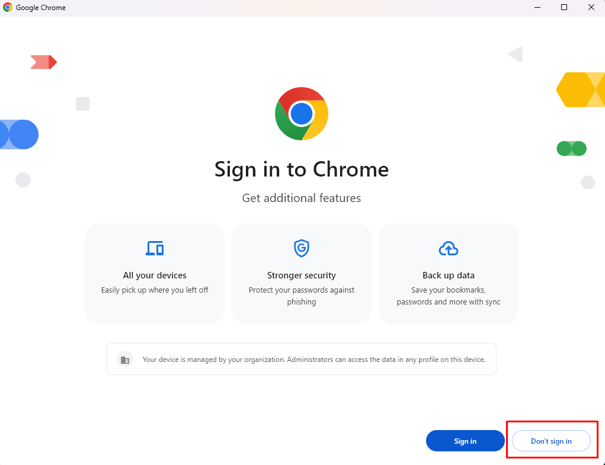
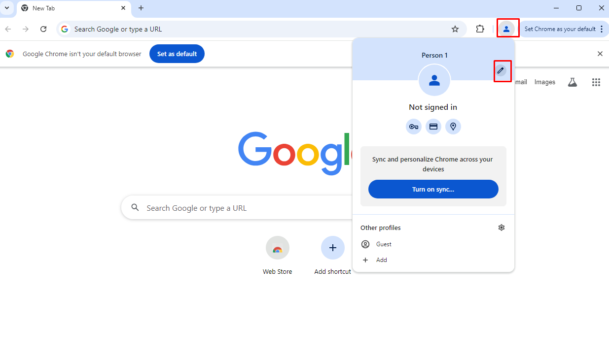

<script>
 function update () {
    const form = document.forms['attendee-form'];
    if (form) {
      form.addEventListener('submit', function (event) {
        event.preventDefault();
        const inputs = Array.from(form.querySelectorAll('input'));
        const values = inputs.reduce((acc, input) => {
          acc[input.id + '_out'] = input.value;
          return acc;
        }, {});

        Object.entries(values).forEach(([id, value]) => {
          const elements = document.getElementsByClassName(id);
          Array.from(elements).forEach(element => {

            console.log(element.innerHTML);
            if(Number(element.innerHTML) > 99 ){
               console.log(`Got a 99+ attendee: ${element.innerHTML}`);
               element.innerHTML = value;
             }
            else{
               console.log(`Got a sub 99 attendee: ${element.innerHTML}`);
               if(element.innerHTML.includes('gmail.com'))
               {
                element.innerHTML = `0${value}`;
                }
               else{
                element.innerHTML = value;
               }
                }
          });
        });
        const attendeeIDInput = form.elements['attendeeID'];
       if (attendeeIDInput && attendeeIDInput.value !== 'Your_Attendee_ID') {
          localStorage.setItem('attendeeID', attendeeIDInput.value);
        }
      });
    }
  };
</script>
<style>
  /* Style for the button */
  button {
    background-color: black; /* Set the background color to black */
    color: white; /* Set the text color to white */
    border: none; /* Remove the border */
    padding: 10px 20px; /* Add some padding for better appearance */
    cursor: pointer; /* Show a pointer cursor on hover */
  }

   /* Style for the input element */
  input[type="text"] {
    border: 2px solid black; /* Set the border thickness to 2px */
    padding: 5px; /* Add some padding for better appearance */

</style>


 Please **`submit the form below with your Attendee or pod ID`**. All configuration entries in the lab guide will be renamed to include your pod ID.
{: .block-warning }

<script>
document.forms["attendee-form"][1].value = localStorage.getItem("attendeeID") || "Your Attendee ID" 
</script>
<form id="attendee-form">
  <label for="attendee">Attendee ID:</label>
  <input type="text" id="attendee" name="attendee" onChange="update()"><br>
<br>
  <button onclick="update()">Save</button>
</form>

<br/>


## Learning Objectives
1. Understand your configuration instructions
2. Familiarize yourself how we will use Google Chrome profiles to simulate the situations for this lab

### Know before you start

1. We will be simulating situations in a **shared lab tenant**
2. The Agents have been configured for you. You will be performing the rest of the configurations to route voice calls
3. All your configurations **should contain your attendee ID** so the lab users don't step over each other
4. Each of you has been provided with the phone number to dial and three agents (we will use only two in the exercises)
5. Please ask for help when you need it

!!! Note
    Since we will be using the same Chrome browser for different roles we will use the **Chrome Browser user profiles** to allow multiple logins into the different components of the Webex contact center. For the control hub, use the Administrator profile created for you in the Chrome browser. Always offer Chrome to **remember your credentials and password** for this lab. The user profiles have been created for you - Admin, Agent 1, Agent 2 and Supervisor





### Creating Chrome user profiles

Open the Windows Terminal (Windows key and type terminal). Paste and run the following code. You will see 4 new Chrome shortcut icons on the desktop

```
$DesktopPath = [Environment]::GetFolderPath("Desktop")
$shell = New-Object -ComObject WScript.Shell
$shortcut = $shell.CreateShortcut("$DesktopPath\WxCC Admin.lnk")
$shortcut.TargetPath = "%PROGRAMFILES%\Google\Chrome\Application\chrome.exe"
$Shortcut.Arguments = "--user-data-dir=%USERPROFILE%\chromeProfiles\admin"
$Shortcut.Save()
$shortcut = $shell.CreateShortcut("$DesktopPath\WxCC Supervisor.lnk")
$shortcut.TargetPath = "%PROGRAMFILES%\Google\Chrome\Application\chrome.exe"
$Shortcut.Arguments = "--user-data-dir=%USERPROFILE%\chromeProfiles\Supervisor"
$Shortcut.Save()
$shortcut = $shell.CreateShortcut("$DesktopPath\WxCC Agent1.lnk")
$shortcut.TargetPath = "%PROGRAMFILES%\Google\Chrome\Application\chrome.exe"
$Shortcut.Arguments = "--user-data-dir=%USERPROFILE%\chromeProfiles\Agent1"
$Shortcut.Save()
$shortcut = $shell.CreateShortcut("$DesktopPath\WxCC Agent2.lnk")
$shortcut.TargetPath = "%PROGRAMFILES%\Google\Chrome\Application\chrome.exe"
$Shortcut.Arguments = "--user-data-dir=%USERPROFILE%\chromeProfiles\Agent2"
$Shortcut.Save()
```


When you click on the links 



You can customize each profile to be easily identifiable with a name or icon of your choice



We will use the **Admin** profile in the next section