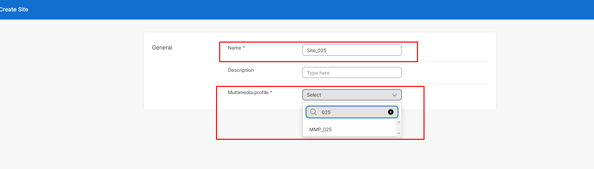
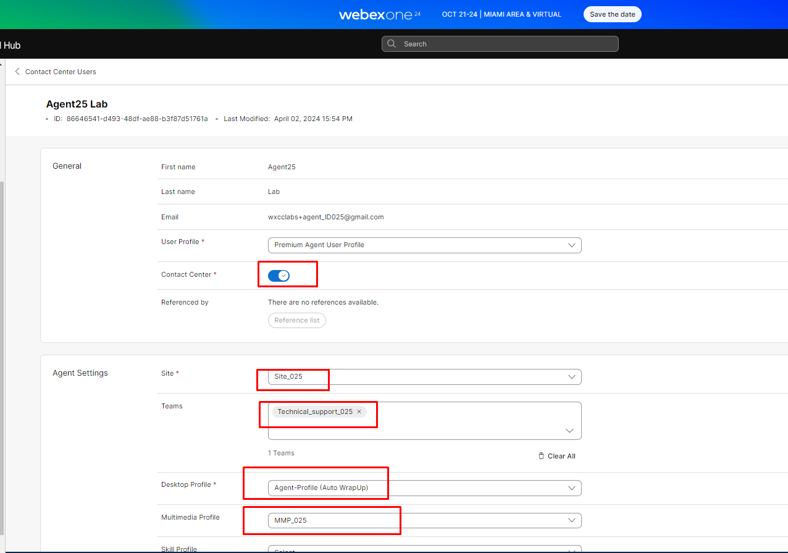
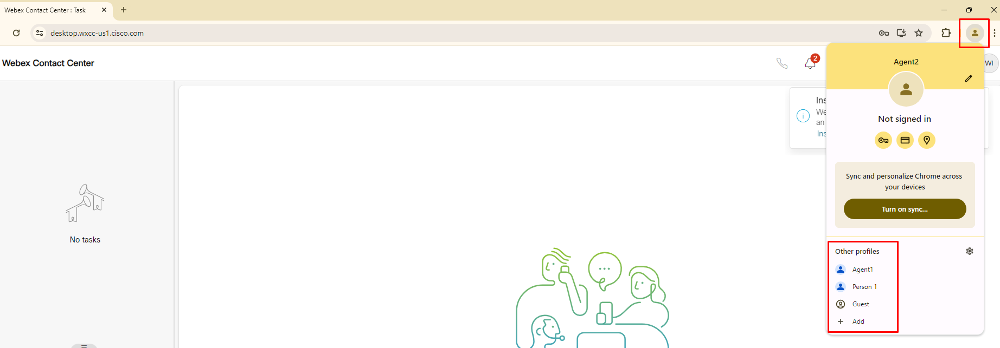

<script>
 function update () {
    const form = document.forms['attendee-form'];
    if (form) {
      form.addEventListener('submit', function (event) {
        event.preventDefault();
        const inputs = Array.from(form.querySelectorAll('input'));
        const values = inputs.reduce((acc, input) => {
          acc[input.id + '_out'] = input.value;
          return acc;
        }, {});

        Object.entries(values).forEach(([id, value]) => {
          const elements = document.getElementsByClassName(id);
          Array.from(elements).forEach(element => {

            console.log(element.innerHTML);
            if(Number(element.innerHTML) > 99 ){
               console.log(`Got a 99+ attendee: ${element.innerHTML}`);
               element.innerHTML = value;
             }
            else{
               console.log(`Got a sub 99 attendee: ${element.innerHTML}`);
               if(element.innerHTML.includes('gmail.com'))
               {
                element.innerHTML = `0${value}`;
                }
               else{
                element.innerHTML = value;
               }
                }
          });
        });
        const attendeeIDInput = form.elements['attendeeID'];
       if (attendeeIDInput && attendeeIDInput.value !== 'Your_Attendee_ID') {
          localStorage.setItem('attendeeID', attendeeIDInput.value);
        }
      });
    }
  };
</script>
<style>
  /* Style for the button */
  button {
    background-color: black; /* Set the background color to black */
    color: white; /* Set the text color to white */
    border: none; /* Remove the border */
    padding: 10px 20px; /* Add some padding for better appearance */
    cursor: pointer; /* Show a pointer cursor on hover */
  }

   /* Style for the input element */
  input[type="text"] {
    border: 2px solid black; /* Set the border thickness to 2px */
    padding: 5px; /* Add some padding for better appearance */

</style>


 Please **`submit the form below with your Attendee or pod ID`**. All configuration entries in the lab guide will be renamed to include your pod ID.
{: .block-warning }

<script>
document.forms["attendee-form"][1].value = localStorage.getItem("attendeeID") || "Your Attendee ID" 
</script>
<form id="attendee-form">
  <label for="attendee">Attendee ID:</label>
  <input type="text" id="attendee" name="attendee" onChange="update()"><br>
<br>
  <button onclick="update()">Save</button>
</form>

<br/>


## Learning Objectives
1. Understand the different configuration objects to enable the agent into the Webex contact center agent desktop
2. Familiarize yourself with the administration interface in Control Hub
3. Create agent profiles and login to the agent desktop

## Create a Multimedia profile

!!! Note
    Since we will be using the same Chrome browser for different roles we will use the **Chrome Browser user profiles** to allow multiple logins into the different components of the Webex contact center. For the control hub, use the Administrator profile created for you in the Chrome browser. Always offer Chrome to **remember your credentials and password** for this lab


Login into Control Hub **<https://admin.webex.com>** with your administrator credentials to begin our configuration


Look for the contact center option in the left pane under ```SERVICES``` – ```Contact Center```


Navigate to ```DESKTOP EXPERIENCE``` - ```Multimedia Profiles``` and click ```Create Multimedia Profile``` on the top right corner of the page


Create a new MMP profile with a name **MMP_<w class = "attendee_out">attendeeID</w>** where ```XYZ``` is the pod ID you have been provided.


Set the **Blended** in the ```More Details``` section and set the ```Voice``` to **1**, ```Chat```, ```Email``` and ```Social``` all to **3**

Click ```Create```


> You have now configured a multimedia profile for the agent to handle 1 voice and 3 each of other digital channels simultaneously


## Create a new site

Under ```USER MANAGEMENT``` on the left pane navigate to ```Sites```

Click ```Create Site``` on the top right corner to create a new site **Site_<w class = "attendee_out">attendeeID</w>** and choose the ```Multimedia Profile``` to the one you created in the previous step **MMP_<w class = "attendee_out">attendeeID</w>**



Click ```Create```

> A site is generally a physical location that the agent belongs to

## Setup Teams and Agents

Under ```USER MANAGEMENT``` in the left pane navigate to ```Teams``` and click ```Create Team```

Create the **Technical_support_<w class = "attendee_out">attendeeID</w>** team where ```XYZ``` is your pod ID. Choose the Site and Multimedia profile you created and ```Create``` the team


> TIP: When you need to look for your entry from a drop down list, typing the pod ID will filter the entries to what you are looking for

Now create the **Billing_inquiry_<w class = "attendee_out">attendeeID</w>** and **General_support_<w class = "attendee_out">attendeeID</w>** teams 


Once finished use the search box at the top of the Teams page to verify your Teams


> You have created teams to which agents will login. Teams belong to a site and all agents in the team will be assigned the same Multimedia profile. A team is a group of agents that perform similar tasks

## Setup Agents

Under ```USER MANAGEMENT``` in the left pane navigate to ```Contact Center Users```

Search for **<w class = "attendee_out">attendeeID</w>** in the search box of the Contact Center Users page. **<w class = "attendee_out">attendeeID</w>** is your pod ID. 


Click on the agent created for your pod and configure them for ```Contact Center```



Now click ```Save```

Configure the other agents for your pod with the following settings

| Name    | Team        |   Desktop Profile     |   MMP Profile     | Agent email                 |
|---------|-------------|-----------------------|-------------------|-----------------------------|
| Agent  | Technical_Support_<w class = "attendee_out">attendeeID</w> | Agent-profile (auto wrapUp) | MMP_<w class = "attendee_out">attendeeID</w> | wxcclabs+agent_ID**<w class = "attendee_out">attendeeID</w>**@gmail.com |
| Agent2  | Billing_inquiry_<w class = "attendee_out">attendeeID</w> | Agent-profile (auto wrapUp) | MMP_<w class = "attendee_out">attendeeID</w> | wxcclabs+agent**2**_ID**<w class = "attendee_out">attendeeID</w>**@gmail.com |
| Agent3  | General_Support_<w class = "attendee_out">attendeeID</w> | Agent-profile (auto wrapUp) | MMP_<w class = "attendee_out">attendeeID</w> | wxcclabs+agent**3**_ID**<w class = "attendee_out">attendeeID</w>**@gmail.com |

> These agents will be used to test contact routing 


## Setup Auxilary codes

Idle or wrap up codes are two types of Auxiliary codes. Idle codes typically indicate why an agent is not available to handle customer contacts such as during a lunch break or meeting. Wrap-up codes indicate the result of the customer interaction, for example, the agent escalated the contact, or sold a service.

Navingate to `DESKTOP EXPERIENCE` - `Idle/Wrap-up Codes` and click on `Create Idle/Wrap-up Code`

Create one or **TechncialSupport**


Click `Create`

Create another one for **BillingInquiry**


Once these wrap-up codes are created we need to make them available to agents. This is done through `Desktop Profiles` that the agents get assigned

Under `DESKTOP EXPERIENCE` - `Desktop Layout` select the `Agent-Profile (Auto WrapUp)` and click on the `Idle/Wrap-up Codes`


Ensure that the `Wrap-up Codes` is selected as `Specific` and select the new wrap-up codes that we created in the previous step. You may need to make one of the wrap-up codes as default

The system will also choose `All` Idle codes available for the agent to indicate their unavailability for handling customer contacts


## Verify acess to the Agent Desktop

> Please use Google Chrome as the web browser when using webRTC as the voice endpoint


Use a different Chrome browser profile for each agent



Navigate to **<https://desktop.wxcc-us1.cisco.com>** and login using the agent configured to the Technical_support team

Remember to login using the below configurations


Once logged in click on the Agent initials on the top right to verify your successful login


Test the login for the other agents using their respective web browser profiles of Google Chrome

In this section you have understood how to access the Control Hub, configure the agents needed for the rest of this lab exercise and log them in with some help from the Chrome browser profiles.